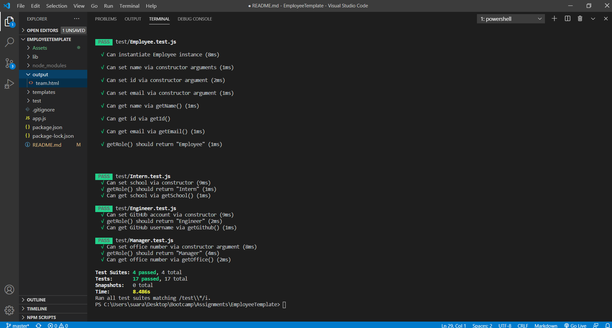
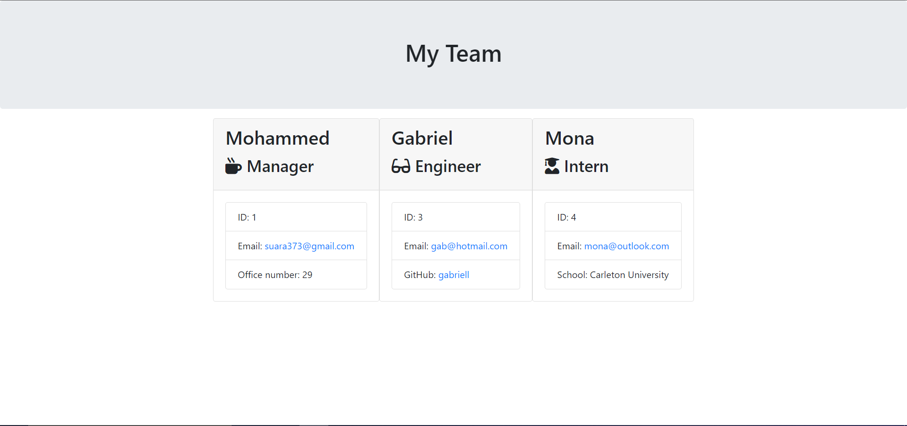

# Template Engine - Employee Summary

A command line application that uses a Node CLI, to take in information about employees, and generates an HTML file displaying the summary for each employee. 

## Table of Contents
* [Installation](#Installation)

* [Usage](#Usage)

* [Test](#Test)

* [Demo](#Demo)

* [Generated File](#Output)

## Installation
The following npm modules should be installed:

* "jest"
* "inquirer"

## Usage
1. Type in "node app" on the command line
2. Enter the team information
3. A "team.html" file will be generated in the output folder

## Test
The test was run using jest: 

 

## Demo
Below is a demo on how to run the application

## Output
